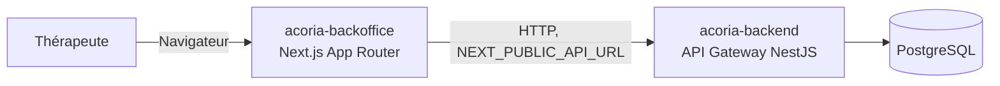

# Acoria Backoffice

Interface web réservée aux thérapeutes d'Acoria pour le suivi de leurs patients : consultation du dashboard, des activités et des statistiques des couples suivis. Construite avec Next.js (App Router).

## Sommaire

- [Architecture](#architecture)
- [Stack technique](#stack-technique)
- [Prérequis](#prérequis)
- [Lancer le projet en local](#lancer-le-projet-en-local)
- [Variables d'environnement](#variables-denvironnement)
- [Tests et qualité](#tests-et-qualité)
- [Déploiement](#déploiement)
- [Contribuer](#contribuer)
- [Ressources](#ressources)
- [Roadmap](#roadmap)

## Architecture



Le backoffice est un client purement front, il ne contient aucune logique métier ni accès direct à la base de données. Toutes les données transitent par l'API `acoria-backend`, avec le même contrôle de rôle (thérapeute) appliqué côté gateway.

## Stack technique

| Composant   | Choix                      |
| ----------- | -------------------------- |
| Framework   | Next.js 16 (App Router)    |
| UI          | React 19, Radix UI, shadcn |
| Styles      | Tailwind CSS 4             |
| Formulaires | React Hook Form + Zod      |
| Langage     | TypeScript                 |

## Prérequis

- Node.js 20 ou supérieur
- npm
- L'API `acoria-backend` accessible (en local ou distante)

## Lancer le projet en local

```bash
# 1. Cloner le repo
git clone https://github.com/loukalost/acoria-backoffice.git
cd acoria-backoffice

# 2. Installer les dépendances
npm install

# 3. Configurer les variables d'environnement
cp .env.example .env
# renseigner NEXT_PUBLIC_API_URL, voir la section ci-dessous

# 4. Lancer le serveur de développement
npm run dev
```

L'application est disponible sur `http://localhost:3000` par défaut.

## Variables d'environnement

| Variable              | Description                           | Exemple                                                            |
| --------------------- | ------------------------------------- | ------------------------------------------------------------------ |
| `NEXT_PUBLIC_API_URL` | URL de base de l'API `acoria-backend` | `http://localhost:3001` (local) ou `https://api.acoria.app` (prod) |

Un fichier `.env.example` est fourni comme référence. Le fichier `.env` réel ne doit jamais être commité.

## Tests et qualité

```bash
npm run lint   # ESLint
npm run build  # build de production, vérifie aussi la compilation TypeScript
```

## Déploiement

Le backoffice est déployé via Docker sur l'infrastructure Scaleway, avec un pipeline GitHub Actions automatisé sur push :

```
[Push] → [Security Check] + [Tests] → [Build & Push image Docker] → [Deploy to Server]
```

Un merge sur la branche principale déclenche automatiquement le build de l'image et son déploiement, aucune intervention manuelle n'est nécessaire.

## Contribuer

- Créer une branche par fonctionnalité ou correctif
- Ouvrir une pull request vers la branche principale
- S'assurer que `npm run lint` et `npm run build` passent avant de merger

## Ressources

- API backend : dépôt `acoria-backend`
- Registre d'images Docker : GitHub Container Registry, image `ghcr.io/loukalost/acoria-backoffice:latest` ([page du package](https://github.com/loukalost/acoria-backoffice/pkgs/container/acoria-backoffice))

## Roadmap

- [ ] `docker-compose.yml` versionné pour lancer backoffice + backend + base de données ensemble en local
- [ ] ADR sur le choix de Next.js App Router pour le backoffice
